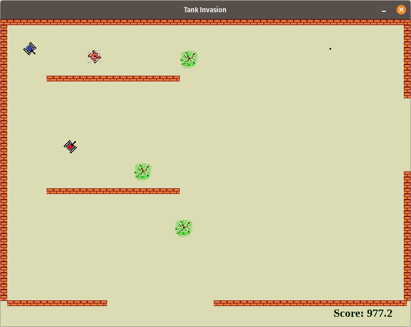

# Tanks SDL2

A classic tank combat game where you battle against enemy tanks across multiple arenas. Originally written as a game example using Free Pascal Lazarus IDE, this version has been ported to C++ using SDL2.



## Game Overview

You are provided with a blue tank. Your mission is to destroy all of the red tanks before your time runs out. Watch out for the red tanks - they will be shooting at you. If you are hit, you lose!

The faster you finish, the higher your score. The top ten scores will be recorded for posterity.

### Objective

- **Survive**: Avoid enemy fire from the red tanks
- **Destroy**: Eliminate all enemy tanks before time runs out
- **Score High**: Complete levels quickly for higher scores

### Gameplay

The enemy will be scattered across four screens or plazas. To move from plaza to plaza, just move through the gap in the block walls at the edge of your plaza. Watch the timer in the lower status bar - when it reaches zero, the game is over!

## Controls

| Key | Action |
|-----|--------|
| **Right Arrow** | Rotate tank right |
| **Left Arrow** | Rotate tank left |
| **Up Arrow** | Move tank forward |
| **Space Bar** | Shoot |

## Requirements

- CMake 3.28 or higher
- C++17 compatible compiler
- SDL2
- SDL2_ttf
- SDL2_image
- SDL2_mixer

## Building

### Linux/Unix

```bash
mkdir build
cd build
cmake ..
make
```

### Running

After building, run the game from the build directory:

```bash
./tanks_sdl2
```

## Project Structure

```
tanks-sdl2/
├── main.cpp              # Main game logic
├── DrawText.cpp/h        # Text rendering utilities
├── gameMessageBox.cpp/h  # Message box implementation
├── Item.h                # Game item definitions
├── fonts/                # Font resources
├── images/               # Game graphics and sprites
├── sounds/               # Sound effects and audio
└── CMakeLists.txt        # Build configuration
```

## License

This project is licensed under the GNU General Public License v3.0 - see the [LICENSE](LICENSE) file for details.

Copyright (c) 2025 Martin Chris Foster

## Credits

Originally created as a Free Pascal Lazarus IDE example project, demonstrating cross-platform game development capabilities.
